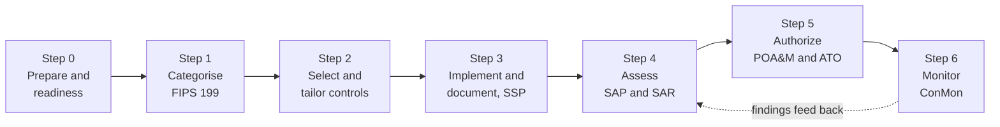

# Keystone Grants Management System (KGMS): FedRAMP Moderate Authorization Portfolio
### NIST Risk Management Framework, Steps 0 through 6

> ### PORTFOLIO EXERCISE, SIMULATED SYSTEM
> **Keystone Grants Management System (KGMS) does not exist.** The Federal Workforce Development Agency (FWDA) is a fictional federal
> agency invented for this portfolio. Every organisation, person, system
> identifier, network address, finding, date and signature on this page is
> fabricated for training purposes, with one exception: the author, Nkeiru Sarah Adesida, is a real person. Where her name appears in a scenario role, that role is fictional, and she has never worked for this agency, which does not exist. Nothing here is drawn from any real
> employer, client or government system, and no real document, artifact or
> data has been reproduced. This file is coursework, not a government record.

---

## What this repository is

This repository walks one system through a complete federal authorization, from the
first readiness conversation to a live continuous monitoring report, using the
NIST Risk Management Framework (RMF) and the FedRAMP Moderate baseline.

Plain language version: before a United States federal agency is allowed to switch
on a computer system that holds people's information, somebody has to prove in
writing that the system is safe enough, say exactly what is still wrong with it, and
promise a date to fix each thing. That paperwork is called an authorization package.
The person who assembles it is usually an Information System Security Officer (ISSO).
This repository is that paperwork, written end to end, for a system that does not
exist.

Every document is written from the ISSO seat: the work of gathering evidence,
testing whether a control really does what the policy claims, writing the finding
down honestly, and tracking it to closure.

---

## Honest scope statement

Read this before judging the artifacts.

| This repository does contain | This repository does not contain |
|---|---|
| A full assessment finding set, all 16 findings itemised with a disposition each | A 400 page production System Security Plan |
| A complete Plan of Action and Milestones, 10 items with owners and milestones | Every one of the 300 plus Moderate baseline controls written out |
| 11 information types categorised with a documented impact decision | Real scanner exports, real screenshots or real evidence files |
| Control implementation narratives for 8 controls, written in full | Anything from a real employer, client or federal system |

Where a sample is shown rather than a full population, the document says so in that
section and states the size of the real population. No summary count in this
repository is typed by hand: each one was generated from the rows underneath it and
checked by a script before publication.

---

## The simulated system

| Field | Detail |
|---|---|
| System name | Keystone Grants Management System (KGMS) |
| System identifier | `FWDA-KGMS-2026-MOD` |
| Operating agency | Federal Workforce Development Agency (FWDA), a fictional agency invented for this portfolio |
| Mission | Receives, reviews, awards and monitors federal workforce development grants |
| Hosting | AWS GovCloud (US-East), Infrastructure as a Service, provided by Keystone Digital Services LLC (fictional) |
| Service model | Agency managed application on an authorised cloud platform |
| Baseline | FedRAMP Moderate, NIST SP 800-53 Rev 5 |
| FIPS 199 category | MODERATE. SC = {(Confidentiality, Moderate), (Integrity, Moderate), (Availability, Moderate)} |
| Authorization path | Agency Authorization to Operate, signed by the AO |
| Authorization granted | 15 May 2026, three year term to 14 May 2029 |
| User population | ~8,400 external grant applicants and grantee staff, 420 agency users, 65 contracted peer reviewers, 9 regional offices |
| Information handled | Grant application content, grantee organisation records including Employer Identification Numbers, individual reviewer PII, award and disbursement records, audit logs |

---

## The RMF lifecycle in this repository

---

## Contents

| Step | Document | Primary reference | Date |
|---|---|---|---|
| [Step 0](step-00-readiness/README.md) | Readiness Assessment Report | FedRAMP readiness criteria | 14 October 2025 |
| [Step 1](step-01-categorization/README.md) | FIPS 199 Security Categorisation Workbook | FIPS 199, SP 800-60 | 7 November 2025 |
| [Step 2](step-02-controls/README.md) | Control Selection, Tailoring Log and Responsibility Matrix | SP 800-53B | 12 December 2025 |
| [Step 3](step-03-ssp/README.md) | System Security Plan, boundary and control narratives | SP 800-18, SP 800-53 Rev 5 | 12 August 2026 |
| [Step 4](step-04-assessment/README.md) | Security Assessment Plan and Security Assessment Report | SP 800-53A | 10 April 2026 |
| [Step 5](step-05-authorization/README.md) | Authorization Package Index, POA&M and ATO Decision Memo | SP 800-37 Rev 2 | 15 May 2026 |
| [Step 6](step-06-conmon/README.md) | Continuous Monitoring Plan and July 2026 monthly report | SP 800-137 | 12 August 2026 |

### Machine readable artifacts

| File | What it is |
|---|---|
| [artifacts/kgms-poam.csv](artifacts/kgms-poam.csv) | The POA&M as a spreadsheet, the format it is actually worked in |
| [artifacts/kgms-assessment-findings.csv](artifacts/kgms-assessment-findings.csv) | All 16 assessment findings with dispositions |
| [artifacts/kgms-fips199-information-types.csv](artifacts/kgms-fips199-information-types.csv) | The categorisation worksheet |

---

## Master timeline

Every document in this repository is dated, and no document references an event that
had not yet happened when it was written. That constraint is checked by script.

| Date | Event |
|---|---|
| 2025-10-14 | Readiness assessment completed (Step 0) |
| 2025-11-07 | FIPS 199 categorisation approved by the AO (Step 1) |
| 2025-12-12 | Control baseline selected and tailoring log approved (Step 2) |
| 2026-01-23 | System Security Plan v1.0 issued (Step 3) |
| 2026-02-13 | Security Assessment Plan approved (Step 4) |
| 2026-03-02 | Independent assessment fieldwork begins |
| 2026-03-27 | Independent assessment fieldwork ends |
| 2026-04-10 | Security Assessment Report final, 16 findings issued |
| 2026-04-24 | System Security Plan v1.2 issued, assessment corrections folded in |
| 2026-05-08 | Authorization package submitted to the AO |
| 2026-05-15 | Authorization to Operate granted, 3 year term to 2029-05-14 |
| 2026-05-29 | Continuous monitoring plan v1.0 effective |
| 2026-06-18 | ISMS internal audit fieldwork completed |
| 2026-07-09 | ISO management review held |
| 2026-07-31 | July continuous monitoring period closes |
| 2026-08-12 | July continuous monitoring report submitted to the AO |
| 2026-08-28 | Framework crosswalk published |
| 2026-08-31 | August continuous monitoring period closes; SSP v1.3 and the risk register quarterly review issued |

---

## Key roles

The Authorizing Official and the Chief Information Security Officer are deliberately
two different people. The AO is a mission executive who accepts risk on behalf of
the programme; the CISO advises. Collapsing both into one person, which is a common
shortcut in training scenarios, would defeat the separation of duties the framework
is built on.

| Role | Name | Organisation | Responsibility in this scenario |
|---|---|---|---|
| Authorizing Official (AO) | Patricia L. Ambrose | FWDA, Deputy Administrator for Workforce Programs | Accepts residual risk and signs the authorization decision |
| Chief Information Security Officer (CISO) | Daniel K. Osei | FWDA, Office of Information Security | Advises the AO; does not sign the authorization decision |
| System Owner | Marcus T. Delacroix | FWDA, Grants Technology Division | Owns the mission function and the system budget |
| Information System Security Officer (ISSO) | Nkeiru Sarah Adesida | FWDA, Grants Technology Division | Day to day security posture, evidence, POA&M upkeep |
| Senior Agency Official for Privacy (SAOP) | Helen M. Barragan | FWDA, Office of Privacy | Privacy threshold analysis and privacy impact assessment |
| Security Control Assessor, lead | Rebecca J. Tran | Ardent Assurance Group LLC | Independent assessment; authored the SAR |
| Cloud Service Provider representative | Alicia R. Vandermeer | Keystone Digital Services LLC, VP Engineering | CSP control implementation and inheritance |
| Cloud Operations Lead | Samuel P. Hargrave | Keystone Digital Services LLC | Infrastructure, patching, configuration baselines |
| Application Development Lead | Priya N. Raghunathan | FWDA, Grants Technology Division | Application code, secure development, input validation |
| Security Operations Manager | Derrick A. Whitmore | FWDA, Office of Information Security | Monitoring, detection, incident response |
| Human Capital Liaison | Yvonne C. Castellanos | FWDA, Office of Human Capital | Screening, onboarding, separation notifications, training records |

---

## Competencies this repository is meant to evidence

- Applying FIPS 199 and the high water mark method, including writing a defensible
  impact adjustment rather than accepting the mechanical result
- Tailoring a control baseline and drawing the line between provider responsibility,
  customer responsibility and shared responsibility
- Writing control implementation narratives that an assessor can actually test
- Building an assessment plan with methods and objects, then reporting findings
  against assessment objectives
- Managing a POA&M so that every open weakness has an owner, a milestone and closure
  evidence, and every assessment finding is accounted for
- Running continuous monitoring: scan cadence, service level agreements, significant
  change review and monthly reporting to the AO

---

## Related repositories

| Repository | What it covers |
|---|---|
| [keystone-kgms-iso27001](https://github.com/Nkee07/keystone-kgms-iso27001) | The same system under ISO/IEC 27001:2022 and ISO/IEC 27005, plus a crosswalk to this repository |
| [keystone-kgms-conmon-vulnmgmt](https://github.com/Nkee07/keystone-kgms-conmon-vulnmgmt) | Continuous monitoring, vulnerability management and security control assessment in Tenable Nessus, ServiceNow and RSA Archer |
| [keystone-kgms-security-plus](https://github.com/Nkee07/keystone-kgms-security-plus) | All five CompTIA Security+ SY0-701 domains applied to the same simulated system |

---

## About the author

**Nkeiru Sarah Adesida**
Cybersecurity Governance, Risk and Compliance analyst. Certified Information Systems
Auditor (CISA) and CompTIA Security+. Master of Science in Cybersecurity Management
and Policy, University of Maryland Global Campus.

Practising areas: NIST Risk Management Framework, security control assessment, risk
assessment, POA&M management, continuous monitoring, and vulnerability management
with Tenable Nessus, ServiceNow and RSA Archer.

[GitHub](https://github.com/Nkee07) | [LinkedIn](https://www.linkedin.com/in/nkeiru-adesida-grc) | [nkiru_sarah@yahoo.com](mailto:nkiru_sarah@yahoo.com)

---

*Author: Nkeiru Sarah Adesida, Information System Security Officer (ISSO), portfolio scenario*  
*Simulated system: Keystone Grants Management System (KGMS) | FWDA-KGMS-2026-MOD*  
*This document is a portfolio exercise built on a fictional organisation. It is not a government record.*  
*[GitHub portfolio](https://github.com/Nkee07) | [LinkedIn](https://www.linkedin.com/in/nkeiru-adesida-grc)*
