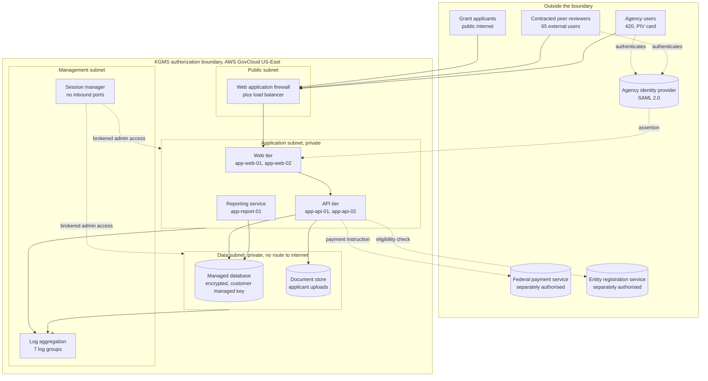

# Step 3: System Security Plan
### Keystone Grants Management System (KGMS) | Boundary, interconnections and control implementation narratives

> ### PORTFOLIO EXERCISE, SIMULATED SYSTEM
> **Keystone Grants Management System (KGMS) does not exist.** The Federal Workforce Development Agency (FWDA) is a fictional federal
> agency invented for this portfolio. Every organisation, person, system
> identifier, network address, finding, date and signature on this page is
> fabricated for training purposes. Nothing here is drawn from any real
> employer, client or government system, and no real document, artifact or
> data has been reproduced. This file is coursework, not a government record.

---

**Document:** System Security Plan, version 1.3  
**Simulated system:** Keystone Grants Management System (KGMS) | `FWDA-KGMS-2026-MOD`  
**Framework and standards:** NIST SP 800-18, NIST SP 800-53 Rev 5, FedRAMP SSP structure  
**Author:** Nkeiru Sarah Adesida  
**Document date:** 12 August 2026  
**Status:** Current. Sections complete, control narratives a documented sample of 8

**Navigation:** [<- Step 2: Select and Tailor Controls](../step-02-controls/README.md) &nbsp;|&nbsp; [Repository home](../README.md) &nbsp;|&nbsp; [Step 4: Assess Controls ->](../step-04-assessment/README.md)

---

## Purpose

The System Security Plan (SSP) is the central document of an authorization package. It
says what the system is, where its edges are, and for every applicable control, how
that control is actually implemented here.

Plain language version: this is the instruction manual for the system's security. An
independent assessor reads it and then tries to prove it is wrong. So every sentence
has to be something a stranger could test.

---

## Honest scope statement

A production Moderate SSP runs to several hundred pages and contains an
implementation narrative for every one of the 300 plus applicable controls. **This
document contains the system identification, boundary, interconnection and
environment sections in full, plus implementation narratives for 8 controls.**

The 8 were chosen deliberately: 6 of them failed assessment, so the narrative can be
read against the finding, and 2 passed, so there is a comparison. A sample of 8
narratives written properly demonstrates more than 300 written thinly.

---

## Section 1: System identification

| Field | Detail |
|---|---|
| System name | Keystone Grants Management System (KGMS) |
| System identifier | `FWDA-KGMS-2026-MOD` |
| System type | Major application |
| Operating agency | Federal Workforce Development Agency (FWDA) (fictional) |
| Mission function | Receives, reviews, awards and monitors federal workforce development grants |
| FIPS 199 category | MODERATE. SC = {(Confidentiality, Moderate), (Integrity, Moderate), (Availability, Moderate)} |
| Control baseline | NIST SP 800-53 Rev 5 Moderate, FedRAMP profile |
| Hosting | AWS GovCloud (US-East), Infrastructure as a Service |
| Cloud Service Provider | Keystone Digital Services LLC (fictional) |
| Operational status | Operational under an Authorization to Operate granted 15 May 2026 |
| SSP version | 1.3 |
| Version 1.0 issued | 23 January 2026 |
| Version 1.2 issued | 24 April 2026, incorporating assessment corrections |
| Version 1.3 issued | 12 August 2026, post authorisation update |

### Version history

| Version | Date | Change |
|---|---|---|
| 1.0 | 23 January 2026 | Initial issue for assessment |
| 1.1 | 12 March 2026 | Corrections raised during fieldwork: AC-6(5) group membership model, RA-5 authenticated scanning |
| 1.2 | 24 April 2026 | SI-10 validation approach rewritten after remediation; AU-11 retention corrected; integrity adjustment dependency on the daily reconciliation control recorded explicitly |
| 1.3 | 12 August 2026 | Post authorisation update. Authorisation status recorded; IA-2(1) narrative updated following reviewer portal federation on 24 July 2026; CM-6 narrative updated following closure of POA-003 on 29 July 2026. **A System Security Plan is a living document: it is revised whenever the system changes, which is why this version postdates the authorisation it supports** |

---

## Section 2: Roles

| Role | Name | Organisation |
|---|---|---|
| Authorizing Official (AO) | Patricia L. Ambrose | FWDA, Deputy Administrator for Workforce Programs |
| Chief Information Security Officer (CISO) | Daniel K. Osei | FWDA, Office of Information Security |
| System Owner | Marcus T. Delacroix | FWDA, Grants Technology Division |
| Information System Security Officer (ISSO) | Nkeiru Sarah Adesida | FWDA, Grants Technology Division |
| Senior Agency Official for Privacy (SAOP) | Helen M. Barragan | FWDA, Office of Privacy |
| Security Control Assessor, lead | Rebecca J. Tran | Ardent Assurance Group LLC |
| Cloud Service Provider representative | Alicia R. Vandermeer | Keystone Digital Services LLC, VP Engineering |
| Cloud Operations Lead | Samuel P. Hargrave | Keystone Digital Services LLC |
| Application Development Lead | Priya N. Raghunathan | FWDA, Grants Technology Division |
| Security Operations Manager | Derrick A. Whitmore | FWDA, Office of Information Security |
| Human Capital Liaison | Yvonne C. Castellanos | FWDA, Office of Human Capital |

The Authorizing Official and the Chief Information Security Officer are two different
people. The AO accepts risk; the CISO advises on it. Contact details are omitted
because every person here is fictional and publishing plausible looking federal email
addresses serves no purpose.

---

## Section 3: System boundary

Everything inside the dashed box is inside the authorization boundary and is the
agency's responsibility to document and defend. Everything outside is either an
interconnected system with its own authorisation, or provider infrastructure inherited
through the platform's authorisation package.

### What is inside, stated as a list

| Component | Count | Note |
|---|---|---|
| Web tier instances | 2 | Public facing, behind the web application firewall |
| API tier instances | 2 | Private subnet, no direct inbound from internet |
| Reporting service instance | 1 | Private subnet, batch and on demand reports |
| Managed database instances | 4 | Primary plus read replica, and two provisioned in the July 2026 release |
| Object storage buckets | 3 | Applicant documents, generated award letters, backups |
| Container images | 3 | Introduced in the March 2026 release |
| Session manager service | 1 | Brokered administrative access, no inbound ports |
| Log groups | 7 | Application, API, database, web server, operating system, control plane, security |

### The three deliberate boundary decisions

1. **The data subnet has no route to the internet.** No network address translation
   gateway, no internet gateway. Package updates for the database tier come through a
   private endpoint. This means a compromised application instance cannot be used to
   exfiltrate directly from the data tier to an external host.
2. **There is no bastion host with an open port.** Administrative access is brokered
   through the session manager service, which is why AC-17 is recorded as tailored in
   Step 2. Nothing in the boundary listens for an inbound administrative connection.
3. **The regional offices are outside the boundary.** They hold no components. Staff
   there are ordinary users over the agency network. This is why finding SAR-015, the
   paper visitor log at one regional office, was risk accepted rather than remediated:
   the location holds nothing the boundary depends on.

---

## Section 4: Interconnections

| External system | Owner | Connection | Data exchanged | Agreement | Impact of that system |
|---|---|---|---|---|---|
| Federal payment processing service (fictional) | Department of the Treasury equivalent, fictional | TLS 1.2 mutually authenticated API over a private link | Payment instruction records outbound, confirmation receipts inbound | Interconnection Security Agreement, 18 September 2025 | Moderate |
| Agency identity provider (fictional) | FWDA Office of the Chief Information Officer | SAML 2.0 federation | Authentication assertions, group membership | Internal memorandum of understanding, 22 August 2025 | Moderate |
| Entity registration verification service (fictional) | Interagency shared service, fictional | TLS 1.2 REST API | Organisation identifiers outbound, registration status inbound | Interconnection Security Agreement, 2 October 2025 | Low |

### The dependency that the categorisation rests on

The payment interconnection carries the compensating control that justifies the
integrity adjustment in Step 1. Every instruction transmitted is reconciled the same
business day against the confirmation receipt and against the obligation balance in
the award record. A mismatch raises an exception.

Recording this in the SSP rather than only in the categorisation workbook is
deliberate. The adjustment is void if the reconciliation is removed or moved to a
weekly cadence, so the dependency has to live where a change reviewer will see it.

---

## Section 5: Applicable laws, regulations and standards

| Instrument | Why it applies |
|---|---|
| Federal Information Security Modernization Act of 2014 (FISMA) | Statutory basis for the federal information security programme and the authorisation requirement |
| FedRAMP Authorization Act of 2022 | Governs the use of cloud services by federal agencies |
| Privacy Act of 1974 | The system maintains records on individuals, so a system of records notice and Privacy Act protections apply |
| E-Government Act of 2002, section 208 | Requires a privacy impact assessment for a system collecting information on the public |
| FIPS 199 | Security categorisation |
| FIPS 200 | Minimum security requirements |
| FIPS 140-3 | Cryptographic module validation for modules protecting federal information |
| NIST SP 800-37 Rev 2 | Risk Management Framework |
| NIST SP 800-53 Rev 5 | Security and privacy controls |
| NIST SP 800-53A Rev 5 | Assessment procedures |
| NIST SP 800-137 | Information security continuous monitoring |
| OMB Circular A-130 | Managing federal information as a strategic resource |
| OMB Circular A-123 | Internal control over the financial reporting relevant to award and disbursement records |

---

## Section 6: Control implementation narratives

Eight controls, written in full. Each narrative states the requirement in plain
language, how this system implements it, what evidence an assessor can test, and where
the implementation failed assessment if it did.

### AC-2 Account Management

**Responsibility:** Customer &nbsp;|&nbsp; **Assessment result:** Satisfied

**Control requirement in plain language:** know every account on the system, know
who approved it, and remove it when it is no longer needed.

**How this system does it.** KGMS has three account populations, and they are
managed differently on purpose.

*Agency users, 420 accounts.* Created only from an approved access request in the
agency service management tool. The request names the requester, the supervisor who
approved it, the application role sought and the business justification. On approval,
an automated job creates the account in the agency identity provider and assigns the
group that maps to the application role. KGMS itself holds no password for
these users.

*Contracted peer reviewers, 65 accounts.* Created for a named review panel and carry a
scheduled expiry date set to the panel end date plus 14 days. Expiry is set at
creation, not tracked separately, because a reviewer account that outlives its panel
is the most likely stale account on this system.

*Service accounts, 9 accounts.* Non interactive, no console access, credentials held
in the platform secrets service and rotated every 90 days. Each has a named human
owner recorded in the inventory.

**Removal.** The Human Capital Liaison sends a separation notification to the identity
provider, which disables the account within one business day. Disable, not delete:
the account object is retained for 180 days so audit records remain attributable.

**Review.** Quarterly. The ISSO exports all accounts with role and last login, the
supervisor for each organisational unit attests line by line, and the attestation is
retained in RSA Archer.

**Inactivity.** Accounts with no login for 35 days are automatically disabled.

**Evidence an assessor can test:** the access request record for any sampled account,
the identity provider audit log showing creation and disablement timestamps, the
quarterly attestation records, and the automated inactivity job configuration.

**Assessment result.** Satisfied. The assessor sampled 25 accounts across the three
populations and traced each to an approved request.

### AC-6(5) Privileged Accounts

**Responsibility:** Customer &nbsp;|&nbsp; **Assessment result:** Other than satisfied

**Control requirement in plain language:** only the people who genuinely need
administrative power should have it, and there should be a record of who agreed to
give it to them.

**How this system does it.** Privileged access is separated into three groups:
application administrator (8 members), cloud infrastructure administrator (5 members,
Keystone Digital Services LLC staff), and database administrator (3 members). Membership requires a privileged
access request with System Owner approval, and is reviewed quarterly rather than
annually because the population is small and the power is high.

Privileged actions are performed from a separate administrative role assumed for the
task, not from the user's day to day account, and every assumption of that role is
logged with a justification string.

**Where it failed.** The assessor pulled the membership list for the application
administrator group and asked for the approval record behind each of the 8 members.
Five had a completed request on file. Three did not.

Of those three: two were operationally necessary and were reauthorised with a
documented System Owner approval during fieldwork. The third belonged to a contractor
whose task order had ended in January 2026; the account had been correctly disabled at
the identity provider but had never been removed from the application administrator
group, so it would have regained privilege if the account were ever re-enabled.

**Root cause.** Group membership inside the application was managed separately from
account status in the identity provider. Disabling the account did not touch the
group.

**Remediation.** Group membership moved under identity provider control so the two can
no longer drift, and all three records corrected. Retested and closed 31 March 2026.
Recorded as finding SAR-003.

**Why this is written up at this length.** A finding that is closed before the package
is submitted is still a finding, and the honest version of the story includes the root
cause, not just the correction.

### AU-6 Audit Record Review, Analysis and Reporting

**Responsibility:** Customer &nbsp;|&nbsp; **Assessment result:** Other than satisfied

**Control requirement in plain language:** somebody actually has to read the logs,
look for patterns, and be able to prove they did.

**How this system does it.** Two cadences. Daily, the security operations centre works
the alert queue generated by detection rules on the seven log groups. Weekly, an
analyst performs a correlated review specifically of privileged account activity
across the application, database and cloud control plane, looking for the patterns a
single alert would not catch: privilege assumed outside business hours, the same
administrator acting across all three planes in one session, bulk record export.

**Where it failed.** The daily review was well evidenced. For the weekly correlated
review the assessor sampled 12 consecutive weeks and found evidence for 6.

Interviews indicated the review was probably performed in most of the missing weeks,
but the analyst's method was to work from a live dashboard and escalate anything
interesting. When nothing was interesting, nothing was written down, so a week with no
findings looked identical to a week with no review.

**The lesson, stated plainly.** For an assessor, an unevidenced control is an
unperformed control. There is no credit for work that left no record. This is the most
common shape of finding in federal assessment work and it is almost never a case of
someone not doing their job.

**Remediation.** A weekly review template that records the queries run, the period
covered, the reviewer, the volume examined and an explicit "no anomalies identified"
where that is the outcome, plus automation to generate the correlated report on a
schedule so the artifact exists whether or not anything interesting is in it.

Recorded as SAR-006, tracked as POA-004, owner Derrick A. Whitmore. Open at the July 2026 report
with 2 of the 4 required consecutive weeks of evidence produced.

### CM-6 Configuration Settings

**Responsibility:** Customer &nbsp;|&nbsp; **Assessment result:** Other than satisfied

**Control requirement in plain language:** decide how each machine should be set
up, set it up that way, and notice when something changes.

**How this system does it.** Each tier has a hardened base image derived from agency
benchmarks: no password based SSH, no unnecessary listening services, audit rules for
privileged command execution, host firewall default deny inbound. Instances are built
only from those images and are treated as replaceable, so a configuration change is
made by rebuilding from a new image rather than by editing a running host.

**Where it failed.** Four of eleven application tier instances had drifted. Two
permitted password based SSH authentication, one exposed an unused web administration
interface on a non standard port, and one was missing the audit rules for privileged
command execution, which means privileged actions on that host were not being
recorded at all.

**Root cause.** Two of the four had been manually patched during an incident in
November 2025 and never rebuilt. The other two were built from an image version that
predated a baseline update. Nothing detected any of it, because there was no drift
detection: the only thing that ever compared a running host to its baseline was an
assessment.

**Why this one matters more than it looks.** The missing audit rules mean the AU family
controls were also degraded on that host. A configuration finding in one family
quietly reduced assurance in another, which is the argument for automated drift
detection rather than periodic manual inspection.

**Remediation.** All four rebuilt from the current approved image, and a continuous
compliance rule now evaluates every instance against its baseline and raises a finding
on deviation. Recorded as SAR-005, tracked as POA-003, closed 29 July 2026 with two
consecutive clean compliance reports as evidence.

### IA-2(1) Multifactor Authentication to Privileged Accounts

**Responsibility:** Customer &nbsp;|&nbsp; **Assessment result:** Other than satisfied

**Control requirement in plain language:** a password on its own is not enough. A
second proof of identity is required.

**How this system does it, for agency users.** All 420 agency accounts authenticate
through the agency identity provider using a PIV card, a physical smart card, with a
certificate and a PIN. That is genuine two factor authentication and it applies to
ordinary and privileged users alike.

**Where it failed.** The 65 contracted peer reviewers do not hold agency PIV cards.
They authenticated to a separate reviewer portal with a username and password only.

That population can read unpublished merit review scores, panel deliberation notes and
applicant personally identifiable information. Phishing a reviewer credential would
yield all of it, and reviewers are a high value phishing target precisely because they
are external, temporary and less exposed to agency security training.

**Why the gap existed.** Not negligence. Extending the identity provider to external
users required additional licences and a procurement cycle, and the reviewer portal was
built as an interim measure that then persisted. This was flagged in the readiness
assessment in October 2025 as gap R-01 with a January 2026 target, and it was not
closed in time.

**Remediation.** The reviewer portal was federated to the agency identity provider with
authenticator application based multifactor authentication for external users, since
issuing PIV cards to short term reviewers is not practical. Enforced for all 65
reviewer accounts on 24 July 2026.

**Evidence retained:** the enforcement policy configuration, a screenshot of a rejected
single factor login attempt, and the enrolment report showing 65 of 65 accounts
enrolled.

Recorded as SAR-001, the single High risk item carried into the POA&M as POA-001.
Closed 24 July 2026.

### RA-5 Vulnerability Monitoring and Scanning

**Responsibility:** Customer &nbsp;|&nbsp; **Assessment result:** Other than satisfied

**Control requirement in plain language:** look for known weaknesses regularly,
and look properly.

**How this system does it.** Tenable Nessus, on three cadences: weekly authenticated
infrastructure scans, monthly authenticated web application scans, and a container
image scan on every build. Findings flow into ServiceNow as tickets and roll up into
RSA Archer for control level reporting. Service level agreements follow the FedRAMP
continuous monitoring requirement: Critical and High within 30 days, Moderate within
90, Low within 180.

**Where it failed.** Scans of the database tier ran unauthenticated. An unauthenticated
scan sees only what is reachable over the network, so it reports the service version
banner and little else. An authenticated scan logs in and enumerates installed package
versions, which is where most real findings are.

The practical effect: the database tier had effectively no meaningful vulnerability
coverage, and the clean scan reports were clean because the scanner could not see
anything, not because there was nothing to see.

**Remediation.** A read only scanning service account with credentialed access was
provisioned, and a full authenticated scan of the database tier completed on 20 March
2026. That first authenticated scan returned 14 findings, 2 of them High, all
remediated within the 30 day service level. Recorded as SAR-009 and closed during
fieldwork.

**Recurrence.** A related weakness reappeared in July 2026: two database instances
provisioned for the July release were never added to the scan target group. Scope
completeness, not scan configuration, and it is raised as POA-011. Scan coverage
depends on inventory accuracy, which is why CM-8 and RA-5 are reported together in the
monthly continuous monitoring report.

### SC-28 Protection of Information at Rest

**Responsibility:** Customer &nbsp;|&nbsp; **Assessment result:** Other than satisfied

**Control requirement in plain language:** information sitting in storage has to be
encrypted, and the agency should control the key.

**How this system does it.** All storage volumes, database storage, object storage and
snapshots are encrypted at rest. In the primary region the encryption key is a
customer managed key in the platform key management service: the agency controls the
key policy, the rotation schedule and who may use it, and every use of the key is
logged to the agency audit trail.

**Where it failed.** Snapshots replicated to the secondary region for disaster recovery
were encrypted with the default service managed key rather than a customer managed key.

The data was encrypted, so this is not an exposure of plaintext. What was lost is
control and visibility: the agency could not rotate that key, could not restrict which
principals may decrypt with it, and received no key usage logs for that copy. Since
the replica holds a full copy of the grant and disbursement data, the weaker key
control applied to a complete copy of the most sensitive information in the system.

**Why it was rated Low rather than Moderate.** The assessor considered Moderate and
settled on Low because the data remained encrypted, the replica bucket was not
publicly reachable, and access to it still required agency credentials. The finding is
about key governance, not about exposed data. The write up records that judgement
because a reader should be able to see why the rating is what it is.

**Remediation.** A customer managed key created in the secondary region, existing
snapshots re-encrypted, replication policy updated. Recorded as SAR-011, tracked as
POA-007, owner Samuel P. Hargrave. Key created 30 July 2026, ahead of milestone; re-encryption not
yet started at the July report.

### SI-10 Information Input Validation

**Responsibility:** Customer &nbsp;|&nbsp; **Assessment result:** Satisfied after remediation

**Control requirement in plain language:** never trust what a user types. Check it,
and make it safe before showing it to anyone else.

**How this system does it.** Server side validation on every input: type and length
checks, an allow list for structured fields, file type and size limits on uploads
with content inspection rather than extension matching, and parameterised queries
throughout so user input never reaches a database as executable text.

**Where it failed.** The grant application form includes a rich text project narrative
field, because applicants legitimately need basic formatting. That field permitted a
limited set of HTML tags. The assessor submitted a script payload that survived the
tag filter, was stored, and executed in the browser of the reviewer who opened the
application.

This is stored cross site scripting, and it is worse than the reflected kind. A
reflected attack needs the victim to click a crafted link. A stored attack sits in the
application waiting, and the victims here were reviewers with access to unpublished
scores and applicant PII. The attacker would be an applicant, that is, anyone on the
internet who can start an application.

**Root cause.** Validation was applied on input using a deny list of dangerous tags.
Deny lists on HTML fail, because the set of ways to express a script in a browser is
larger than any list of them.

**Remediation.** Two changes. Input is now parsed against an explicit allow list of
permitted elements and attributes, rejecting everything else. Output is encoded for
the context it is rendered into, so even a payload that somehow reached storage would
render as visible text rather than execute. Defence at both ends, because either one
alone is a single point of failure.

Retested by the assessor on 24 March 2026 with the original payload and four variants.
All rendered as inert text. Recorded as SAR-002 and closed during fieldwork.

**Note.** This was predicted. The readiness assessment in October 2025 recorded gap
R-03, input validation on rich text fields, with a January 2026 target. It was not
closed in time and became a High finding.

---

## Section 7: Operating environment

| Layer | Implementation |
|---|---|
| Region | AWS GovCloud US-East, primary. Secondary region used for snapshot replication only, no running compute |
| Compute | Hardened Linux instances built from agency approved images, replaced rather than patched in place |
| Database | Managed relational service, encrypted at rest with a customer managed key, automated nightly backup with a 35 day retention window |
| Network | Three tier subnet model. Public subnet holds only the load balancer and web application firewall. Data subnet has no internet route |
| Encryption in transit | TLS 1.2 minimum externally. Mutual TLS on the payment interconnection |
| Encryption at rest | Customer managed key in the primary region. Secondary region key remediation tracked as POA-007 |
| Identity | Federated to the agency identity provider. PIV card for agency users, authenticator application for external reviewers since July 2026 |
| Logging | Seven log groups to the agency log platform. One year online, two years archived |
| Monitoring | Platform telemetry plus agency detection rules, alert queue worked daily by the security operations centre |
| Configuration | Continuous compliance evaluation against the approved baseline, active since July 2026 |
| Scanning | Tenable Nessus, weekly authenticated infrastructure, monthly web application, per build container |
| Governance tooling | ServiceNow for issue and remediation workflow, RSA Archer for control level reporting and evidence retention |

Proceed to Step 4, assessment.

---

**Navigation:** [<- Step 2: Select and Tailor Controls](../step-02-controls/README.md) &nbsp;|&nbsp; [Repository home](../README.md) &nbsp;|&nbsp; [Step 4: Assess Controls ->](../step-04-assessment/README.md)

---

*Author: Nkeiru Sarah Adesida, Information System Security Officer (ISSO), portfolio scenario*  
*Simulated system: Keystone Grants Management System (KGMS) | FWDA-KGMS-2026-MOD*  
*This document is a portfolio exercise built on a fictional organisation. It is not a government record.*  
*[GitHub portfolio](https://github.com/Nkee07) | [LinkedIn](https://www.linkedin.com/in/nkeiru-adesida-grc)*
