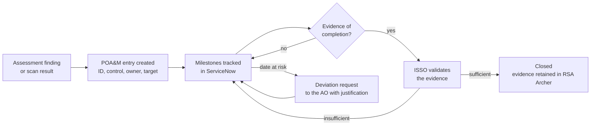

# Step 5: Authorization Package, POA&M and ATO Decision Memorandum
### Keystone Grants Management System (KGMS) | 10 open items, every finding accounted for

> ### PORTFOLIO EXERCISE, SIMULATED SYSTEM
> **Keystone Grants Management System (KGMS) does not exist.** The Federal Workforce Development Agency (FWDA) is a fictional federal
> agency invented for this portfolio. Every organisation, person, system
> identifier, network address, finding, date and signature on this page is
> fabricated for training purposes. Nothing here is drawn from any real
> employer, client or government system, and no real document, artifact or
> data has been reproduced. This file is coursework, not a government record.

---

**Document:** Authorization Package Index, Plan of Action and Milestones, and Authorization Decision Memorandum  
**Simulated system:** Keystone Grants Management System (KGMS) | `FWDA-KGMS-2026-MOD`  
**Framework and standards:** NIST SP 800-37 Rev 2 Step 5, OMB Circular A-130  
**Author:** Nkeiru Sarah Adesida  
**Document date:** 15 May 2026  
**Status:** Complete

**Navigation:** [<- Step 4: Assess Controls](../step-04-assessment/README.md) &nbsp;|&nbsp; [Repository home](../README.md) &nbsp;|&nbsp; [Step 6: Monitor Controls ->](../step-06-conmon/README.md)

---

## Purpose

Authorisation is the moment a named senior official reads everything, accepts what is
still wrong, and signs. This document is the package index, the Plan of Action and
Milestones, and the decision memorandum.

Plain language version: the inspector has finished. Somebody senior now has to decide
whether to let the system run anyway, knowing exactly what is still broken. They write
down what they are accepting and sign their name to it. That signature is the whole
point of the framework: risk is accepted by a person, in writing, not absorbed by an
organisation.

---

# PART A: AUTHORIZATION PACKAGE INDEX

Submitted to the Authorizing Official on 8 May 2026.

| # | Document | Owner | Version | Date | Status |
|---|---|---|---|---|---|
| 1 | System Security Plan | Nkeiru Sarah Adesida | 1.2 | 24 Apr 2026 | The version the AO read. Superseded by v1.3 on 31 Aug 2026 |
| 2 | FIPS 199 Security Categorisation Workbook | Nkeiru Sarah Adesida | 1.1 | 7 Nov 2025 | Approved by the AO |
| 3 | Control Tailoring Log and Responsibility Matrix | Nkeiru Sarah Adesida | 1.0 | 12 Dec 2025 | Final |
| 4 | Privacy Threshold Analysis | Helen M. Barragan | 1.0 | 3 Oct 2025 | Final |
| 5 | Privacy Impact Assessment | Helen M. Barragan | 1.0 | 19 Dec 2025 | Final |
| 6 | Security Assessment Plan | Rebecca J. Tran | 1.0 | 13 Feb 2026 | Final |
| 7 | Security Assessment Report | Rebecca J. Tran | 1.0 | 10 Apr 2026 | Final |
| 8 | Plan of Action and Milestones | Nkeiru Sarah Adesida | 1.0 | 8 May 2026 | Open, 10 items |
| 9 | Contingency Plan | Marcus T. Delacroix | 2.0 | 31 Jul 2026 | Updated after SAR-007 |
| 10 | Incident Response Plan | Derrick A. Whitmore | 1.3 | 14 Nov 2025 | Final |
| 11 | Configuration Management Plan | Samuel P. Hargrave | 1.1 | 12 Dec 2025 | Final |
| 12 | Continuous Monitoring Plan | Nkeiru Sarah Adesida | 1.0 | 29 May 2026 | Effective |
| 13 | System boundary and data flow diagrams | Nkeiru Sarah Adesida | 1.2 | 24 Apr 2026 | Final |
| 14 | System component inventory | Samuel P. Hargrave | Rolling | 31 Jul 2026 | Corrected under POA-010 |
| 15 | Interconnection Security Agreement, payment service | Marcus T. Delacroix | 1.0 | 18 Sep 2025 | Executed |
| 16 | Interconnection Security Agreement, registration service | Marcus T. Delacroix | 1.0 | 2 Oct 2025 | Executed |
| 17 | Memorandum of understanding, agency identity provider | Marcus T. Delacroix | 1.0 | 22 Aug 2025 | Executed |
| 18 | Risk acceptance memorandum, SAR-015 | Patricia L. Ambrose | 1.0 | 15 May 2026 | Signed |
| 19 | Authorization to Operate decision memorandum | Patricia L. Ambrose | 1.0 | 15 May 2026 | Signed |

Note on document 9: the contingency plan shows a date later than the package
submission because it was revised in July 2026 under POA-005. The index is maintained
as a living record after authorisation rather than frozen at submission, and the
version history makes clear which version the AO read.

---

# PART B: PLAN OF ACTION AND MILESTONES

## B1: What a POA&M is

A Plan of Action and Milestones is the list of things still wrong with the system.
Each entry names one weakness, who owns fixing it, the date it will be fixed by, and
the interim steps.

Plain language version: it is the snag list on a new building. The building is allowed
to open, but everything on the snag list has a name and a date against it, and somebody
checks the list every month.

Two rules make it real rather than decorative. First, **every open assessment finding
appears on it**, with no exceptions. Second, **closure requires evidence**, not an
assertion that the work was done.

## B2: How this POA&M reconciles with the assessment

| Source | Count |
|---|---|
| Findings reported in the Security Assessment Report | 16 |
| Closed during fieldwork and retested by the assessor, no POA&M entry required | 5 |
| Formally risk accepted by the AO, recorded in the decision memorandum | 1 |
| **Open findings carried into this POA&M** | **10** |

5 plus 1 plus 10 equals
16. Every finding is accounted for. A POA&M that carries fewer items than
the assessment reported, with no explanation for the difference, is the single most
common defect in an authorisation package, and it is trivially detectable by
subtraction.

## B3: POA&M register

| POA&M ID | From finding | Control | Weakness | Risk | Owner | Target close |
|---|---|---|---|---|---|---|
| POA-001 | SAR-001 | IA-2(1) | Multifactor authentication not enforced for the peer reviewer portal | High | Samuel P. Hargrave | 2026-07-31 |
| POA-002 | SAR-004 | SI-2 | Unremediated OpenSSH vulnerability on two bastion hosts | Moderate | Samuel P. Hargrave | 2026-06-30 |
| POA-003 | SAR-005 | CM-6 | Configuration baseline deviations on four of eleven application instances | Moderate | Samuel P. Hargrave | 2026-07-31 |
| POA-004 | SAR-006 | AU-6 | Audit record review is performed but not evidenced at the required frequency | Moderate | Derrick A. Whitmore | 2026-08-31 |
| POA-005 | SAR-007 | CP-4 | Contingency plan test not performed within the last twelve months | Moderate | Marcus T. Delacroix | 2026-09-30 |
| POA-006 | SAR-008 | SR-3 | Supply chain risk management procedures drafted but not approved | Moderate | Nkeiru Sarah Adesida | 2026-08-31 |
| POA-007 | SAR-011 | SC-28 | Backup snapshots in the secondary region not encrypted with the customer managed key | Low | Samuel P. Hargrave | 2026-09-30 |
| POA-008 | SAR-012 | IA-5 | Authenticator management policy predates the current agency standard | Low | Nkeiru Sarah Adesida | 2026-08-31 |
| POA-009 | SAR-013 | PS-4 | Separation checklist not evidenced for two of nine separations | Low | Yvonne C. Castellanos | 2026-09-30 |
| POA-010 | SAR-014 | CM-8 | Component inventory omits three container images | Low | Priya N. Raghunathan | 2026-10-30 |

### By severity

| Risk rating | Count |
|---|---|
| High | 1 |
| Moderate | 5 |
| Low | 4 |
| **Total** | **10** |

Computed from the register rows above, not entered separately.

### By owner

| Owner | Items |
|---|---|
| Samuel P. Hargrave | 4 |
| Nkeiru Sarah Adesida | 2 |
| Derrick A. Whitmore | 1 |
| Marcus T. Delacroix | 1 |
| Yvonne C. Castellanos | 1 |
| Priya N. Raghunathan | 1 |
| **Total** | **10** |

Ten items across 6 owners. Remediation ownership is distributed because
it genuinely is distributed: a missing separation checklist belongs to Human Capital, an
unencrypted snapshot belongs to Cloud Operations, and an inventory gap in the build
pipeline belongs to Application Development. A POA&M where one person owns every item
is a POA&M nobody has read properly.

## B4: Milestones

| POA&M ID | Weakness | Interim milestones |
|---|---|---|
| POA-001 | Multifactor authentication not enforced for the peer reviewe... | Procure IdP licences 2026-06-05; pilot with 8 reviewers 2026-06-26; enforce for all reviewers 2026-07-31 |
| POA-002 | Unremediated OpenSSH vulnerability on two bastion hosts | Validate patch in staging 2026-06-12; patch bastion-01 2026-06-19; patch bastion-02 2026-06-26 |
| POA-003 | Configuration baseline deviations on four of eleven applicat... | Remediate 4 instances 2026-06-30; add automated drift detection 2026-07-31 |
| POA-004 | Audit record review is performed but not evidenced at the re... | Define review template 2026-07-15; automate weekly report 2026-08-14; produce 4 consecutive weeks of evidence 2026-08-31 |
| POA-005 | Contingency plan test not performed within the last twelve m... | Update contingency plan 2026-07-31; functional restore test 2026-09-15; after action report 2026-09-30 |
| POA-006 | Supply chain risk management procedures drafted but not appr... | Finalise procedure 2026-07-24; System Owner approval 2026-08-14; brief development team 2026-08-31 |
| POA-007 | Backup snapshots in the secondary region not encrypted with ... | Create secondary region CMK 2026-08-14; re-encrypt existing snapshots 2026-09-15; update replication policy 2026-09-30 |
| POA-008 | Authenticator management policy predates the current agency ... | Redraft policy section 2026-07-10; security review 2026-08-07; publish v2.0 2026-08-31 |
| POA-009 | Separation checklist not evidenced for two of nine separatio... | Recover 2 missing checklists 2026-08-15; move checklist into the HR workflow tool 2026-09-30 |
| POA-010 | Component inventory omits three container images | Add the 3 images to inventory 2026-08-29; wire the build pipeline to register images automatically 2026-10-30 |

## B5: POA&M lifecycle

The validation step matters. An owner marking their own item closed is not closure. The
ISSO reviews the evidence against what the finding actually said, and sends it back if
the evidence proves something adjacent rather than the thing itself.

---

# PART C: AUTHORIZATION DECISION MEMORANDUM

> **This memorandum is a training exercise.** Patricia L. Ambrose is not a real person, the
> Federal Workforce Development Agency (FWDA) is not a real agency, and this is not a government record. It is
> written in the form of a real decision memorandum because learning the form is the
> point of the exercise.

## C1: Decision

| Field | Detail |
|---|---|
| System | Keystone Grants Management System (KGMS) \| `FWDA-KGMS-2026-MOD` |
| Decision | **Authorization to Operate granted** |
| Date of decision | 15 May 2026 |
| Authorization termination date | 14 May 2029 |
| Authorizing Official | Patricia L. Ambrose, Deputy Administrator for Workforce Programs |
| Recommended by | Daniel K. Osei, Chief Information Security Officer |
| Assessment relied upon | Security Assessment Report dated 10 April 2026, Ardent Assurance Group LLC |
| Impact level | MODERATE |

## C2: Risk acceptance statement

I have reviewed the System Security Plan, the Security Assessment Report and the Plan
of Action and Milestones for Keystone Grants Management System (KGMS).

The assessment reported 16 findings. 5 were
remediated during fieldwork and independently retested. 10 remain open and are
tracked under the Plan of Action and Milestones. One finding, SAR-015, I am formally
accepting rather than requiring remediation.

**On the open High risk finding.** SAR-001, single factor authentication for 65
contracted peer reviewers, is the only High risk item carried forward. I accept it for a
bounded period on three conditions: the reviewer population remains capped at 65 and
scoped to active panels; reviewer accounts continue to expire automatically at panel end
plus 14 days; and multifactor authentication is enforced no later than 31 July 2026. I
have been advised the constraint is procurement, not engineering. **If the 31 July date
is missed, this authorisation is subject to reconsideration.**

**On the risk I am accepting outright.** SAR-015, a paper visitor log at one of nine
regional offices, is accepted permanently. That location houses no system component;
staff there use KGMS as ordinary users over the agency network. Requiring an
electronic badge system at a site that holds nothing the boundary depends on would spend
money without reducing risk. Reviewed at each annual assessment.

**On the integrity categorisation.** I approved the adjustment of integrity from High to
Moderate on 7 November 2025. That approval rests entirely on the daily two way
reconciliation between KGMS and the federal payment processing service. **If that
reconciliation is removed, weakened, or moved to a less frequent cadence, the adjustment
is void and the system reverts to a High integrity categorisation**, which would require
reauthorisation against the High baseline. I am directing that any change to the
reconciliation control be brought to me before implementation, not reported after.

**What I am not satisfied with.** SAR-006, audit record review performed but not
evidenced, concerns me more than its Moderate rating suggests. A control that leaves no
record cannot be relied on in an investigation, and it is the control I would most need
if this system were compromised. I expect the automated weekly report in production by
31 August 2026 and I will be reviewing the evidence personally at the first quarterly
review rather than relying on the closure report.

Residual risk is acceptable to agency operations and to the individuals whose
information this system holds. Authorisation granted.

## C3: Conditions of authorisation

1. SAR-001 closed by 31 July 2026. Missing this date triggers reconsideration.
2. All remaining POA&M items closed by their stated target dates. A slipped date
   requires a deviation request to the AO with a justification, before the date passes.
3. Monthly continuous monitoring reports submitted by the 15th of the following month.
4. Any change to the daily payment reconciliation control brought to the AO before
   implementation.
5. Significant changes assessed for security impact before deployment, with the AO
   notified of any change affecting the boundary, the interconnections or the
   categorisation.
6. Annual assessment covering one third of controls plus every previously failed
   control.

## C4: Signature block

*Scenario signature. This is a portfolio exercise and not a government record.*

Patricia L. Ambrose
Deputy Administrator for Workforce Programs
Authorizing Official, Federal Workforce Development Agency (FWDA) (fictional)
15 May 2026

---

## Machine readable version

The POA&M is published as [artifacts/kgms-poam.csv](../artifacts/kgms-poam.csv),
which is the format it is actually worked in.

Proceed to Step 6, continuous monitoring.

---

**Navigation:** [<- Step 4: Assess Controls](../step-04-assessment/README.md) &nbsp;|&nbsp; [Repository home](../README.md) &nbsp;|&nbsp; [Step 6: Monitor Controls ->](../step-06-conmon/README.md)

---

*Author: Nkeiru Sarah Adesida, Information System Security Officer (ISSO), portfolio scenario*  
*Simulated system: Keystone Grants Management System (KGMS) | FWDA-KGMS-2026-MOD*  
*This document is a portfolio exercise built on a fictional organisation. It is not a government record.*  
*[GitHub portfolio](https://github.com/Nkee07) | [LinkedIn](https://www.linkedin.com/in/nkeiru-adesida-grc)*
